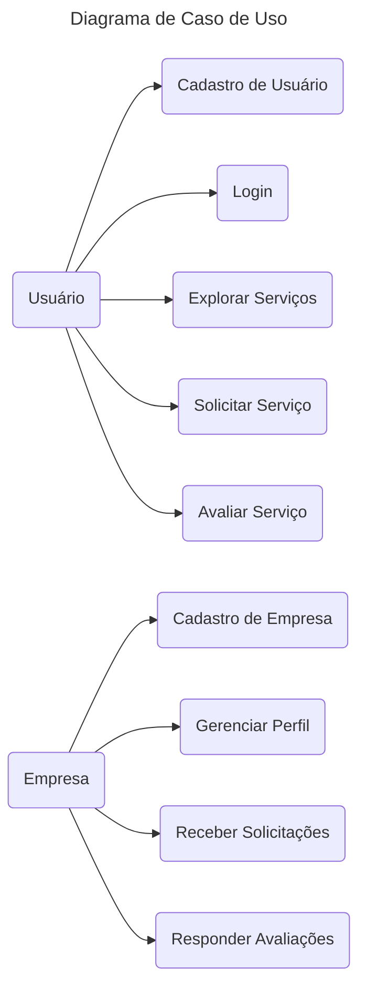

# Diagrama de Caso de Uso

O Diagrama de Caso de Uso (Use Case Diagram) é uma representação visual das interações entre os usuários (atores) e os diferentes casos de uso de um sistema. No contexto da plataforma WAI Conecta, este diagrama ilustra como os usuários (clientes e empresas) interagem com a plataforma para realizar diversas atividades. Abaixo está a descrição detalhada dos atores e dos casos de uso representados no diagrama, juntamente com o diagrama em Mermaid.

#### Atores
1. **Usuário**:
      - Um indivíduo que utiliza a plataforma WAI Conecta para buscar e solicitar serviços.
      - Realiza atividades como cadastro, login, exploração de serviços, solicitação de serviços e avaliação dos serviços recebidos.

2. **Empresa**:
      - Uma empresa registrada na plataforma WAI Conecta que oferece seus serviços aos usuários.
      - Realiza atividades como cadastro, gerenciamento de perfil, recepção de solicitações de serviço e resposta a avaliações de clientes.

#### Casos de Uso
1. **Cadastro de Usuário**:
      - Permite que o usuário crie uma conta na plataforma, fornecendo informações básicas como nome, e-mail e senha.
   
2. **Login**:
      - Permite que o usuário acesse sua conta na plataforma usando suas credenciais (e-mail e senha).

3. **Explorar Serviços**:
      - Permite que o usuário navegue pela plataforma e explore os diferentes serviços oferecidos pelas empresas cadastradas.

4. **Solicitar Serviço**:
      - Permite que o usuário selecione um serviço específico e envie uma solicitação para a empresa que oferece esse serviço.

5. **Avaliar Serviço**:
      - Permite que o usuário deixe uma avaliação sobre o serviço recebido, incluindo comentários e nota.

6. **Cadastro de Empresa**:
      - Permite que uma empresa crie uma conta na plataforma, fornecendo informações como nome, CNPJ, endereço e descrição dos serviços.

7. **Gerenciar Perfil**:
      - Permite que a empresa edite e atualize as informações do seu perfil, incluindo descrição, serviços oferecidos, horários de funcionamento, etc.

8. **Receber Solicitações**:
      - Permite que a empresa receba e visualize as solicitações de serviço enviadas pelos usuários.

9. **Responder Avaliações**:
      - Permite que a empresa responda às avaliações deixadas pelos usuários, interagindo diretamente com o feedback recebido.

#### Diagrama de Caso de Uso em Mermaid

### Descrição dos Casos de Uso
1. **Cadastro de Usuário (UC1)**:
      - **Objetivo**: Permitir que novos usuários se registrem na plataforma.
      - **Atores**: Usuário.
      - **Fluxo Principal**:
        1. O usuário acessa a página de registro.
        2. Preenche o formulário de cadastro com nome, e-mail e senha.
        3. Submete o formulário.
        4. O sistema verifica as informações e cria uma nova conta.
        5. O usuário recebe uma confirmação por e-mail.
   
2. **Login (UC2)**:
      - **Objetivo**: Permitir que usuários registrados façam login na plataforma.
      - **Atores**: Usuário.
      - **Fluxo Principal**:
        1. O usuário acessa a página de login.
        2. Insere suas credenciais (e-mail e senha).
        3. O sistema verifica as credenciais.
        4. O usuário é autenticado e redirecionado para o seu perfil.
   
3. **Explorar Serviços (UC3)**:
      - **Objetivo**: Permitir que os usuários naveguem e explorem os serviços oferecidos pelas empresas.
      - **Atores**: Usuário.
      - **Fluxo Principal**:
        1. O usuário acessa a plataforma.
        2. Utiliza a barra de pesquisa ou navega pelas categorias de serviços.
        3. Visualiza as descrições e detalhes dos serviços.
   
4. **Solicitar Serviço (UC4)**:
      - **Objetivo**: Permitir que os usuários enviem solicitações de serviço para as empresas.
      - **Atores**: Usuário.
      - **Fluxo Principal**:
        1. O usuário seleciona um serviço.
        2. Envia uma solicitação para a empresa responsável.
        3. A empresa recebe e visualiza a solicitação.

5. **Avaliar Serviço (UC7)**:
      - **Objetivo**: Permitir que os usuários avaliem os serviços recebidos.
      - **Atores**: Usuário.
      - **Fluxo Principal**:
        1. Após utilizar um serviço, o usuário acessa a seção de avaliações.
        2. Deixa um comentário e atribui uma nota.
        3. A avaliação é publicada e visível para outros usuários e a empresa.

6. **Cadastro de Empresa (UC5)**:
      - **Objetivo**: Permitir que novas empresas se registrem na plataforma.
      - **Atores**: Empresa.
      - **Fluxo Principal**:
        1. A empresa acessa a página de registro de empresas.
        2. Preenche o formulário com informações como nome, CNPJ, endereço e descrição.
        3. Submete o formulário.
        4. O sistema verifica as informações e cria uma nova conta de empresa.
        5. A empresa recebe uma confirmação por e-mail.

7. **Gerenciar Perfil (UC6)**:
      - **Objetivo**: Permitir que as empresas atualizem suas informações de perfil.
      - **Atores**: Empresa.
      - **Fluxo Principal**:
        1. A empresa acessa seu perfil.
        2. Edita as informações necessárias, como descrição, serviços oferecidos e horários de funcionamento.
        3. Salva as alterações.
   
8. **Receber Solicitações (UC8)**:
      - **Objetivo**: Permitir que as empresas recebam e visualizem as solicitações de serviços enviadas pelos usuários.
      - **Atores**: Empresa.
      - **Fluxo Principal**:
        1. A empresa acessa a seção de solicitações.
        2. Visualiza as novas solicitações recebidas.
        3. Responde ou toma as ações necessárias.
   
9. **Responder Avaliações (UC9)**:
      - **Objetivo**: Permitir que as empresas respondam às avaliações dos usuários.
      - **Atores**: Empresa.
      - **Fluxo Principal**:
        1. A empresa acessa a seção de avaliações.
        2. Visualiza os comentários dos usuários.
        3. Responde às avaliações para interagir com os clientes e melhorar seu serviço.

