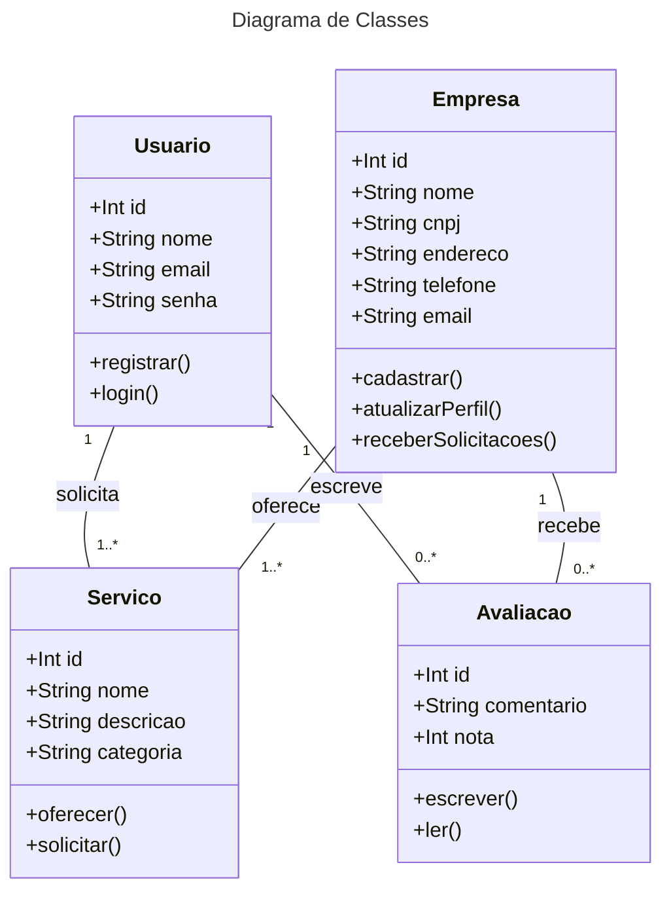

# Diagrama de Classes

```mermaid
---
title: Diagrama de Classes
---
classDiagram
    class Usuario {
        +Int id
        +String nome
        +String email
        +String senha
        +registrar()
        +login()
    }
    
    class Empresa {
        +Int id
        +String nome
        +String cnpj
        +String endereco
        +String telefone
        +String email
        +cadastrar()
        +atualizarPerfil()
        +receberSolicitacoes()
    }
    
    class Servico {
        +Int id
        +String nome
        +String descricao
        +String categoria
        +oferecer()
        +solicitar()
    }
    
    class Avaliacao {
        +Int id
        +String comentario
        +Int nota
        +escrever()
        +ler()
    }
    
    Usuario "1" -- "1..*" Servico: solicita
    Empresa "1" -- "1..*" Servico: oferece
    Usuario "1" -- "0..*" Avaliacao: escreve
    Empresa "1" -- "0..*" Avaliacao: recebe

```