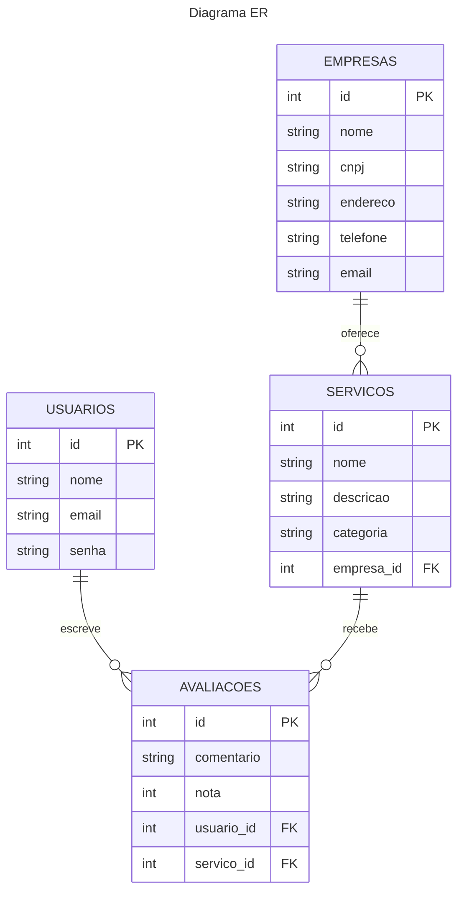

# Diagrama de Entidade-Relacionamento (ER)

O Diagrama de Entidade-Relacionamento (ER) é uma representação visual das entidades e seus relacionamentos no banco de dados da plataforma WAI Conecta. Este diagrama ajuda a entender a estrutura dos dados, como eles se relacionam e como são armazenados. Abaixo está uma descrição detalhada de cada entidade e seus relacionamentos, juntamente com o diagrama em Mermaid.

#### Entidades e Atributos
1. **USUARIOS**:
    - **id**: Identificador único do usuário (chave primária).
    - **nome**: Nome completo do usuário.
    - **email**: Endereço de e-mail do usuário.
    - **senha**: Senha do usuário para autenticação.

2. **EMPRESAS**:
    - **id**: Identificador único da empresa (chave primária).
    - **nome**: Nome oficial da empresa.
    - **cnpj**: Cadastro Nacional da Pessoa Jurídica, usado para verificar a autenticidade da empresa.
    - **endereco**: Endereço físico da empresa.
    - **telefone**: Número de telefone para contato.
    - **email**: Endereço de e-mail da empresa.

3. **SERVICOS**:
    - **id**: Identificador único do serviço (chave primária).
    - **nome**: Nome do serviço oferecido.
    - **descricao**: Descrição detalhada do serviço.
    - **categoria**: Categoria do serviço para facilitar a busca e organização.
    - **empresa_id**: Identificador da empresa que oferece o serviço (chave estrangeira).

4. **AVALIACOES**:
    - **id**: Identificador único da avaliação (chave primária).
    - **comentario**: Comentário do usuário sobre o serviço.
    - **nota**: Nota dada pelo usuário ao serviço.
    - **usuario_id**: Identificador do usuário que escreveu a avaliação (chave estrangeira).
    - **servico_id**: Identificador do serviço avaliado (chave estrangeira).

#### Relacionamentos
- **USUARIOS e AVALIACOES**:
    - Um usuário pode escrever várias avaliações. Este relacionamento é representado como "um para muitos" (1:N), onde um usuário escreve muitas avaliações.
  
- **SERVICOS e AVALIACOES**:
    - Um serviço pode receber várias avaliações de diferentes usuários. Este relacionamento também é "um para muitos" (1:N), onde um serviço recebe muitas avaliações.
  
- **EMPRESAS e SERVICOS**:
    - Uma empresa pode oferecer vários serviços. Este relacionamento é "um para muitos" (1:N), onde uma empresa oferece muitos serviços.

#### Diagrama

### Descrição do Diagrama
- **USUARIOS ||--o{ AVALIACOES: escreve**:
    - Um usuário pode escrever várias avaliações, mas cada avaliação é escrita por um único usuário.
  
- **SERVICOS ||--o{ AVALIACOES: recebe**:
    - Um serviço pode receber várias avaliações, mas cada avaliação está associada a um único serviço.
  
- **EMPRESAS ||--o{ SERVICOS: oferece**:
    - Uma empresa pode oferecer vários serviços, mas cada serviço é oferecido por uma única empresa.
