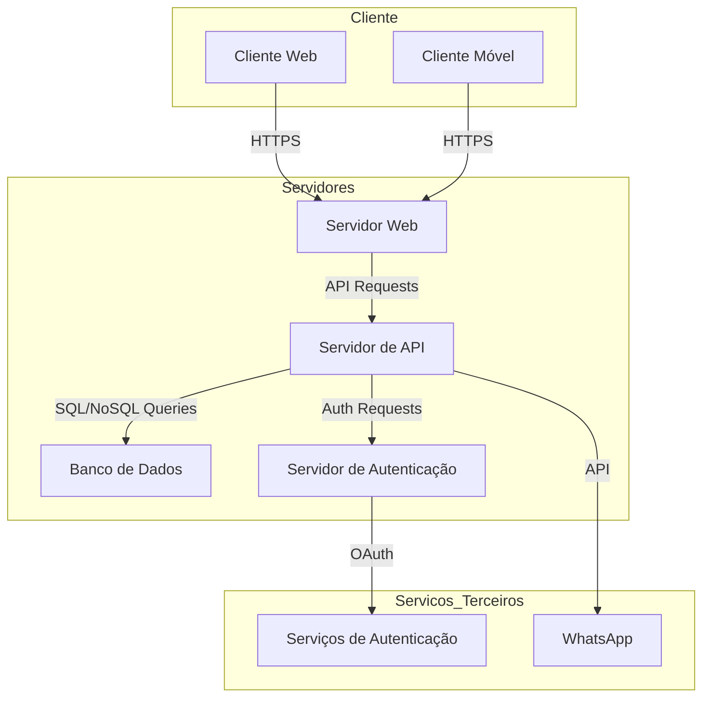

# Diagrama de Implantação

O Diagrama de Implantação (Deployment Diagram) mostra a arquitetura física do sistema, incluindo hardware e software, servidores, dispositivos móveis, e como os componentes do sistema são distribuídos entre eles. Abaixo está o diagrama de implantação para a plataforma WAI Conecta, juntamente com uma descrição detalhada.

#### Descrição

A plataforma WAI Conecta é implementada utilizando uma arquitetura moderna e escalável, composta por servidores web, banco de dados, servidores de API e dispositivos clientes (web e móveis). A seguir está a descrição detalhada dos componentes e sua distribuição.

1. **Cliente Web**:
      - Dispositivo de um usuário que acessa a plataforma através de um navegador web.
      - Frontend desenvolvido em FlutterFlow, que se comunica com a API para carregar e exibir dados.

2. **Cliente Móvel**:
      - Dispositivo móvel de um usuário que acessa a plataforma através de um aplicativo móvel (Android e iOS).
      - O aplicativo móvel também é desenvolvido em FlutterFlow e se comunica com a API para carregar e exibir dados.

3. **Servidor Web**:
      - Hospeda o frontend da aplicação, servindo o conteúdo estático para os clientes web.
      - Pode ser implementado em um servidor de hospedagem como AWS S3, Google Cloud Storage, ou um servidor tradicional com NGINX ou Apache.

4. **Servidor de API**:
      - Implementado utilizando Strapi, um CMS headless que gerencia a lógica de negócio e a interação com o banco de dados.
      - Exposta endpoints RESTful ou GraphQL que são consumidos pelo frontend.

5. **Banco de Dados**:
      - Armazena todos os dados da aplicação, incluindo informações de usuários, empresas, serviços e avaliações.
      - Pode ser implementado utilizando um banco de dados relacional (por exemplo, PostgreSQL, MySQL) ou um banco de dados NoSQL (por exemplo, MongoDB).

6. **Servidor de Autenticação**:
      - Gerencia a autenticação e autorização dos usuários.
      - Pode utilizar serviços como Firebase Authentication, Auth0, ou outro serviço de autenticação.

7. **Serviços de Terceiros**:
      - Inclui integrações com serviços como Google e Apple para registro e login, e WhatsApp para comunicação direta.

#### Diagrama de Implantação em Mermaid

### Componentes do Diagrama
1. **Cliente Web**:
      - Navegador do usuário acessando a plataforma.
      - Comunicação segura via HTTPS com o servidor web.

2. **Cliente Móvel**:
      - Aplicativo móvel em dispositivos Android e iOS.
      - Comunicação segura via HTTPS com o servidor web.

3. **Servidor Web**:
      - Serve o frontend da aplicação.
      - Redireciona requisições de API para o servidor de API.

4. **Servidor de API (Strapi)**:
      - Gerencia as requisições de dados e lógica de negócios.
      - Exposição de endpoints RESTful/GraphQL.
      - Comunicação com o banco de dados e o servidor de autenticação.

5. **Banco de Dados**:
      - Armazena todos os dados da aplicação.
      - Consultas e atualizações de dados gerenciadas pelo servidor de API.

6. **Servidor de Autenticação**:
      - Gerencia autenticação e autorização dos usuários.
      - Integração com serviços de autenticação de terceiros.

7. **Serviços de Terceiros**:
      - Integração com Google e Apple para registro e login.
      - Integração com WhatsApp para comunicação direta.
