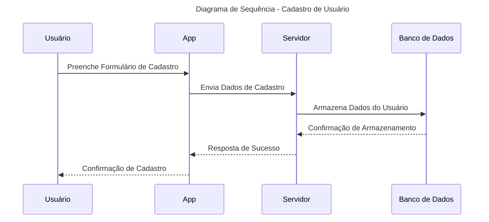
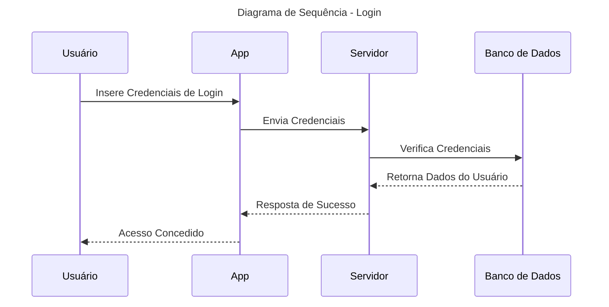
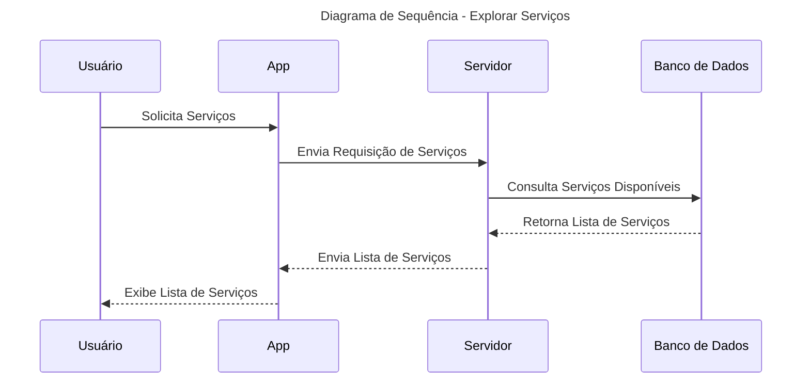
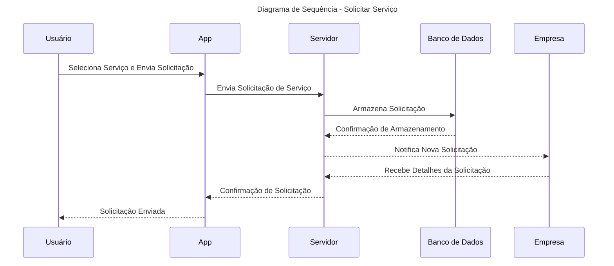
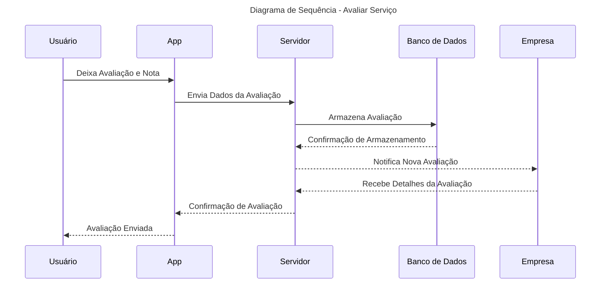
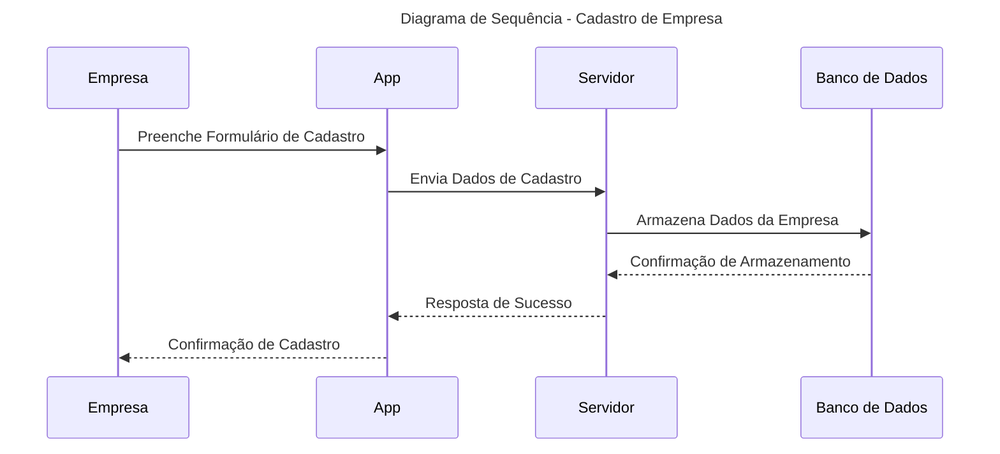
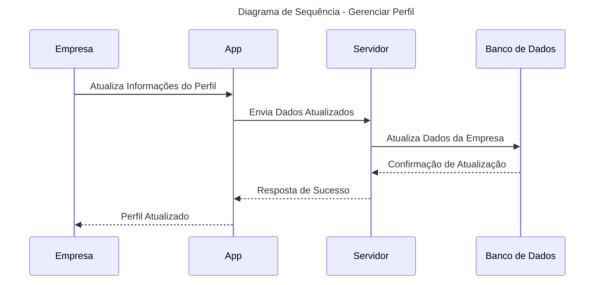
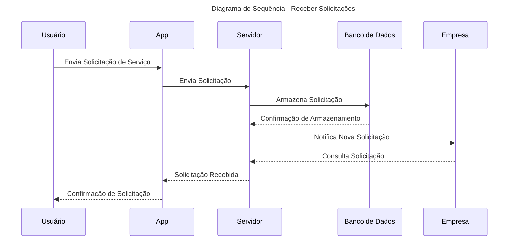
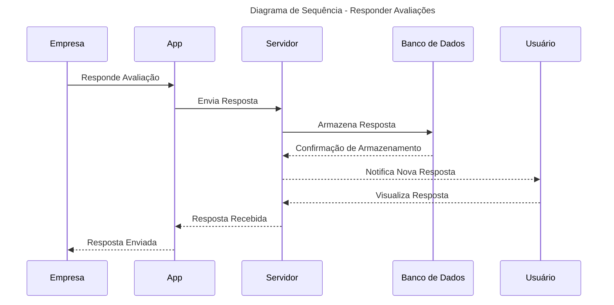

# Diagrama de Sequência

#### Cadastro de Usuário

#### Login

#### Explorar Serviços

#### Solicitar Serviço

#### Avaliar Serviço

#### Cadastro de Empresa

#### Gerenciar Perfil

#### Receber Solicitações

#### Responder Avaliações

Com estes diagramas de sequência, podemos visualizar claramente a interação entre os diferentes componentes do sistema durante as principais operações da plataforma WAI Conecta. Isso ajuda a garantir que todos os fluxos de trabalho sejam bem compreendidos e corretamente implementados.